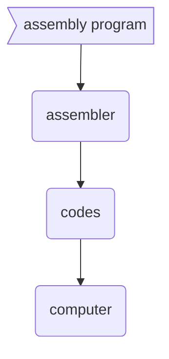
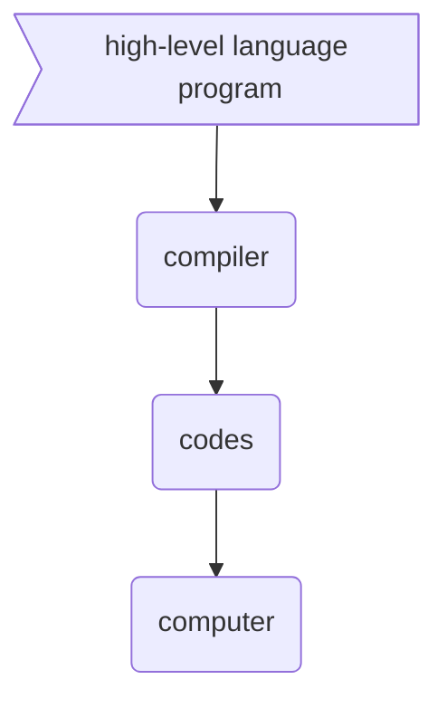
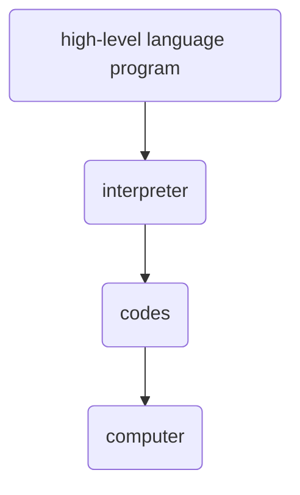

#  in-class problem

**course** eecs 468 programming paradigms

**date** august 23rd 2023

**name**  morgan bergen

###  1.  in your own words, describe what an assembler does

in low level-rpogramming an assembler serves as a bridge between human friendly assembly language and the computer's machine code.  assembly language employs mnemonics, which are more understandable terms or shortcodes representing machine level instructions.  for example

`ld r1, r2` means "move data"

`add r1, r2, r3` means "add data"

`cmp r1, r2` means "compare data"

`goto label_44` means "jump to another set of instructions"

these are mnemonics that provide a easier way for humans to interface with the machine compared to directly dealing with machine code.  assembly has a one to one mapping to machine code.  by using labels in assembly programmers no longer have to remember specific memory addresses where data and code reside.  an assembler takes an assembly program and processes it to produce corresponding machine code or "codes".  in essence, an assembler operates a program to generate another program.

###  2.  in your own words, describe what a compiler does

a compiler is a tool that translates source code written in realatively high level programming languages into machine code or another lower-level language which is termed as target code.  a compiler produces an execuatble program from source code given, enabling the computer's hardware to execute the program directly or through another system tool.

while both compilers and assemblers transform code into a format that can be executed by a computer, they operate at different levels.  a compiler will translate high-level language code into machine code, while an assembler translates assembly language a low level, symbolic representation of machine code into actual machine code.

###  3.  in your own words, describe what an interpreter does.

An intrepreter is a program that executes code line by line which allows a program to run directly from the source code with without the need for a prior compilation step.  this approaches offers immediate feedback, but can be slower since translation happens in real time.

###  4. in your own words, describe what an imperative programming language is.

an imperative language instructs the computer on how to do things step by step, it forces on the sequence of tasks, using statemenst that change a program's state.  it's like giving turn by turn directions to reach your destination. 

###  5. in your own words, describe what a declarative programming language is.

a declarative language focuses on the what, instead of the how.  so instead of listing out step by step instructions it declares the desired results, letting the computer figure out the best way to achieve them.  it's like stating the destination without specifying the route.

###  6. in your own words, describe what a domain specific language is.

a domain specific language is tailored for a specific application, and was built and can be optimized for it's unique needs given that specific application.  it's not intended for general purpose use, only a targeted domain.

###  7. which of the following is an imperative language? Which is a declarative language?

a) Python is imperative
b) C++ is imperative
c) JavaScript is imperative
d) Haskell is declarative
